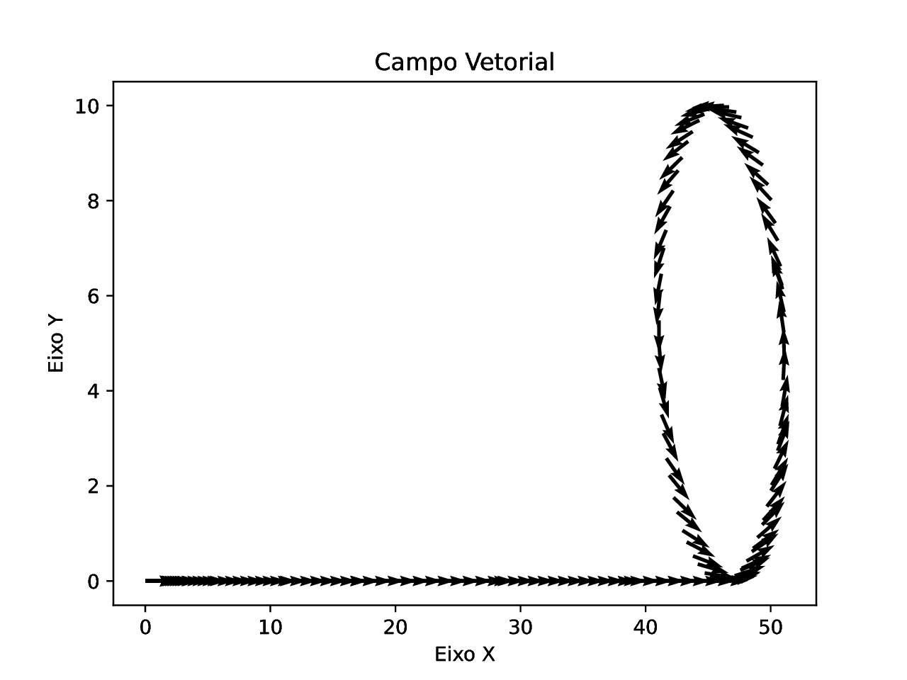
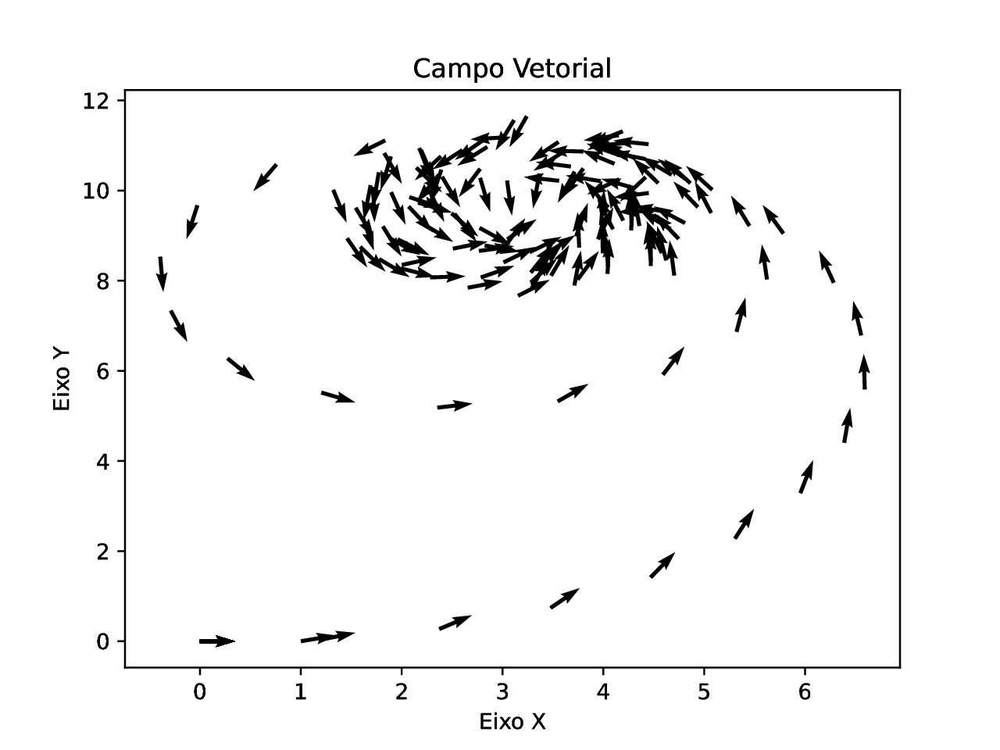

# POSITION

This script reads */cmd_vel* topic of type *Twist* (geometry_msgs.msg library).

The script receives a message from the topic (/cmd_vel) and calculates a 2D estimate (X position, Y position and theta orientation) based on this information. There are some considerations made in the script: Here we are assuming that the robot will only perform "forward" movements and rotations, that is, it does not move perpendicularly (sideways).

To carry out the script tests, I used the [Pequi-Mecanico-Home/albot](https://github.com/Pequi-Mecanico-Home/albot) project by user @Pequi-Mecanico-Home .

### some trajectories:



### Other trajectories:
In the "Videos" folder there is a video containing an example of the script (in the previous version) for viewing

script_name: position.py
package: position/


## Requirements
- ROS2

## Run
- Clone the repository as it contains the ROS2 package
- Do: ```colcon build # in your workspace```
- Do: ```source install/setup.bash # in your workspace```
- Do: ```ros2 run position position```
